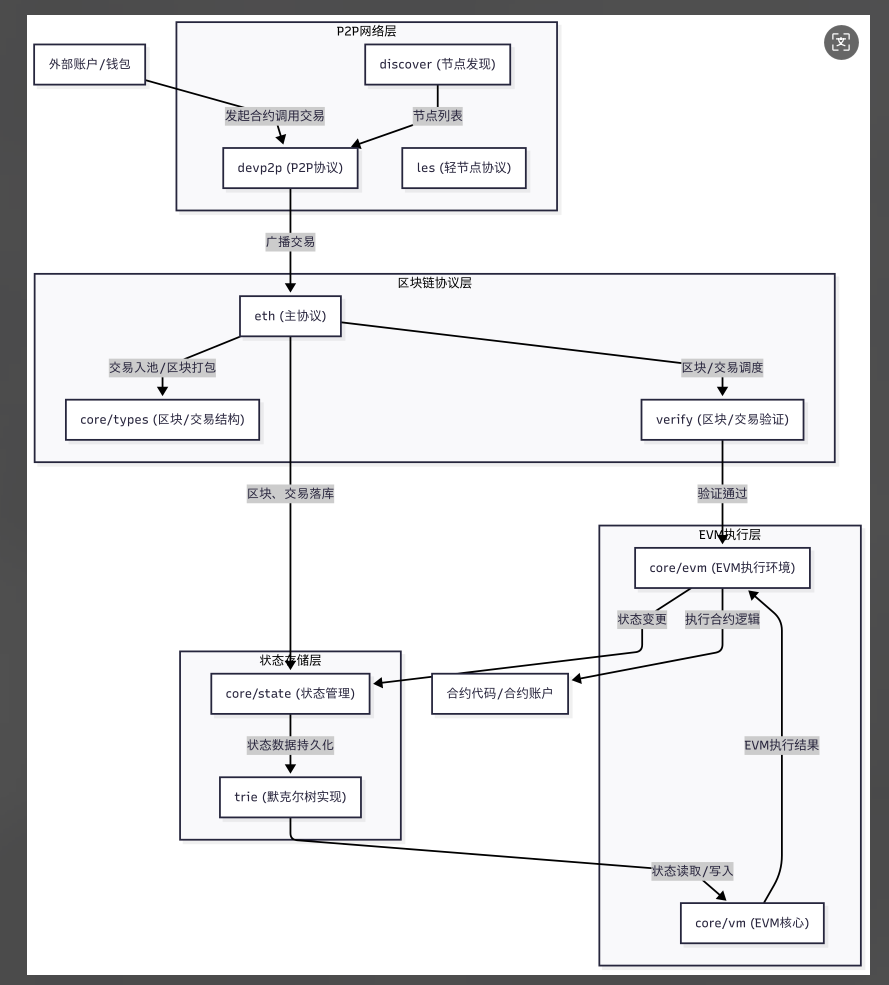
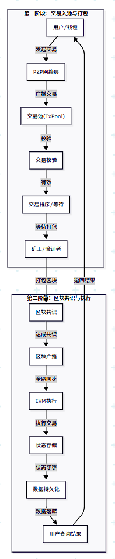
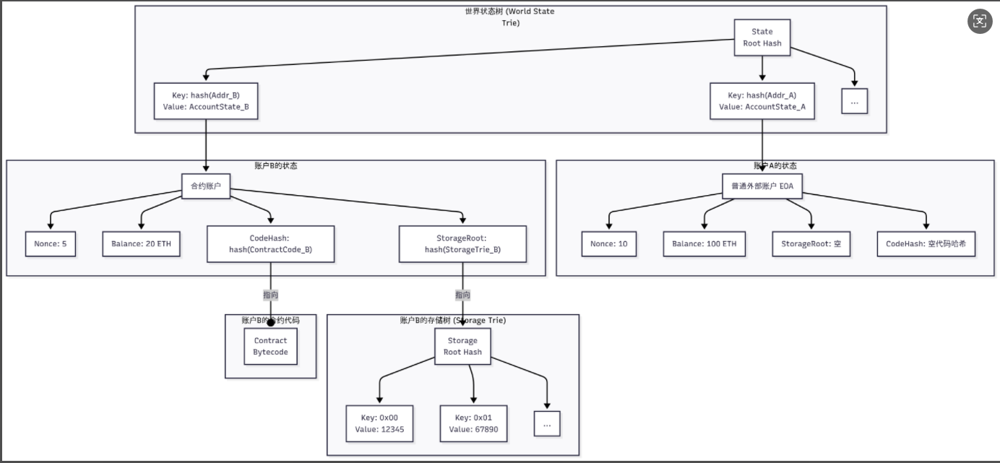

## Go-Ethereum 核心功能与架构设计研究

## 一、Go-Ethereum的基本概念

### 1.Geth在以太坊生态中的定位

**以太坊官方实现之一**

- Geth是以太坊基金会官方维护的三大主流客户端之一（Geth、Nethermind、Besu）。

- 用Go语言编写，开源、跨平台，社区活跃，节点数量最多。

**全节点/轻节点/私链支持**

- 支持全节点、轻节点、私有链、测试链等多种运行模式。

- 既可作为主网节点参与共识，也可作为开发、测试、企业链的基础设施。

**生态基础设施**

- 钱包、DApp、矿池、区块浏览器等大量生态工具和服务都基于Geth。

- 提供RPC、WebSocket、GraphQL等多种API接口，便于外部系统集成。

解析核心模块交互关系：

区块链同步协议（eth/62,eth/63）

交易池管理与Gas机制

EVM执行环境

构建共识算法实现（Ethash/POS）

## 2.核心模块交互关系：

#### （1）.区块链同步协议（eth/62, eth/63）

- 作用：实现节点间区块、交易、状态等数据的高效同步。

- 协议版本：

- eth/62：基础区块同步，支持区块头、区块体、交易、状态等数据的请求与响应。

- eth/63：在62基础上增加了对状态数据（MPT节点）的同步能力。

#### （2）交互流程：

1. 节点发现与连接（P2P层）

1. 握手协商支持的协议版本

1. 通过GetBlockHeaders、GetBlockBodies、GetNodeData等消息请求数据

1. 对方返回BlockHeaders、BlockBodies、NodeData等消息

#### （3）与其他模块关系：

同步模块与本地区块链数据库、交易池、状态树等紧密协作，保证数据一致性。

### 2. 交易池管理与Gas机制

#### （1）交易池（TxPool）：

- 缓存尚未上链的交易，分为pending（可立即打包）和queued（等待条件满足）两类。

- 负责交易的去重、排序、优先级管理（按Gas Price、Nonce等）。

- 对外提供交易广播、查询、打包等接口。

#### （2）Gas机制：

- 每笔交易需指定Gas Limit和Gas Price。

- Gas用于衡量交易/合约执行的计算和存储消耗，防止资源滥用。

- 矿工优先打包Gas Price高的交易，形成市场竞争。

#### （3）交互关系：

- 交易池与P2P网络交互，接收/广播交易。

- 与EVM、区块打包模块协作，决定哪些交易能被执行和上链。

### 3. EVM执行环境构建

#### （1）EVM（以太坊虚拟机）：

- 负责智能合约的字节码执行，支持Solidity、Vyper等多种高级语言编译产物。

- 提供沙盒环境，隔离合约执行，防止恶意操作影响全局状态。

#### （2）执行流程：

​	交易被矿工/验证者选中，进入区块打包流程

​	EVM加载合约代码，初始化执行上下文（账户、存储、输入数据等）

​	按操作码逐步执行，消耗Gas，修改状态树

​	执行结束，返回结果/错误，更新区块状态

#### （3）与其他模块关系：

- EVM与状态树（MPT）、交易池、共识模块紧密协作，确保状态变更的原子性和可验证性。

##### P2P网络层

- discover (节点发现)

基于Kademlia DHT算法，负责让新节点找到并加入以太坊网络，维护一个动态的、分布式的节点通讯录。

- devp2p (P2P协议)

以太坊P2P网络协议，负责节点之间的连接、加密、认证和消息传递，是区块链通信的基础。

- les (轻节点协议)

轻节点协议（Light Ethereum Subprotocol），支持轻客户端与全节点之间的高效数据同步（如区块头、账户状态），降低轻节点的资源消耗。

------

### 4. 共识算法实现（Ethash/POS）

#### （1）Ethash（POW）：

- 以太坊早期采用的工作量证明算法，依赖显卡计算哈希，保证区块难以伪造。

- Geth实现了Ethash的完整挖矿、验证、难度调整等流程。

#### （2）POS（Proof of Stake）：

- 以太坊2.0升级后采用的权益证明机制，依赖质押ETH和验证者投票。

- Geth在合并后主要负责与信标链（Beacon Chain）通信，执行区块和状态变更，不再负责出块和共识。

#### （3）交互关系：

- 共识模块与区块链数据库、EVM、P2P网络协作，决定区块的合法性和链的最终性。

## 二、架构设计

### 1、分层架构图

#### P2P网络层

- discover (节点发现)

基于Kademlia DHT算法，负责让新节点找到并加入以太坊网络，维护一个动态的、分布式的节点通讯录。

- devp2p (P2P协议)

以太坊P2P网络协议，负责节点之间的连接、加密、认证和消息传递，是区块链通信的基础。

- les (轻节点协议)

轻节点协议（Light Ethereum Subprotocol），支持轻客户端与全节点之间的高效数据同步（如区块头、账户状态），降低轻节点的资源消耗。

##### 区块链协议层

- eth (主协议)

以太坊核心协议，定义区块、交易、同步、共识等消息格式和处理逻辑，是区块链运行的“规则手册”。

- core/types (区块/交易结构)

区块、交易、收据等基础数据结构的定义，为区块链协议层提供标准化的数据骨架。

- verify (区块/交易验证)

负责对区块和交易进行合法性校验，包括区块头验证、交易签名验证、Gas检查、共识规则校验等，是保证区块链安全的关键。

------

##### 状态存储层

- trie (默克尔树实现)

默克尔-帕特里夏树（MPT）实现，负责高效、可验证地存储账户、合约、存储等状态数据，保证状态的完整性和不可篡改。

- core/state (状态管理)

状态管理模块，负责账户余额、合约存储等状态的读写和变更，基于trie实现，是EVM执行的基础。

------

##### EVM执行层

- core/vm (EVM核心)

以太坊虚拟机核心，定义操作码、执行流程、Gas计量等，是智能合约的“CPU”。

- core/evm (EVM执行环境)

负责初始化EVM上下文、合约调用、与状态层交互等，是EVM与区块链其他模块交互的“桥梁”。

------

##### 外部实体

- 外部账户/钱包

用户与以太坊网络交互的入口，负责发起交易、查询余额等。

- 合约代码/合约账户

部署在区块链上的智能合约代码，以及存储合约状态的合约账户。

## 三、交易流程图

## 四、账户状态存储模型

### 模型说明

顶层是世界状态树，它的根哈希（State Root Hash）被记录在每个区块头中，代表了该区块执行完毕后整个以太坊世界的“快照”。

这棵树的键（Key）是账户地址的哈希，值（Value）是该账户的账户状态（Account State），经过RLP编码后的结果。

账户状态包含四个字段：Nonce, Balance, StorageRoot, CodeHash。

- 对于普通账户（如账户A），StorageRoot和CodeHash基本为空。

- 对于合约账户（如账户B），StorageRoot指向它自己独有的存储树的根哈希，CodeHash则指向其合约代码的哈希。

1. 存储树是另一棵独立的MPT树，专门用来存放一个合约内部的持久化变量。

这个模型通过MPT树的嵌套和哈希链接，既实现了高效的状态存储和查找，又保证了所有数据的完整性和可验证性。任何一个微小的改动（哪怕是一个合约变量的改变）都会逐层向上传导，最终改变顶层的State Root Hash。